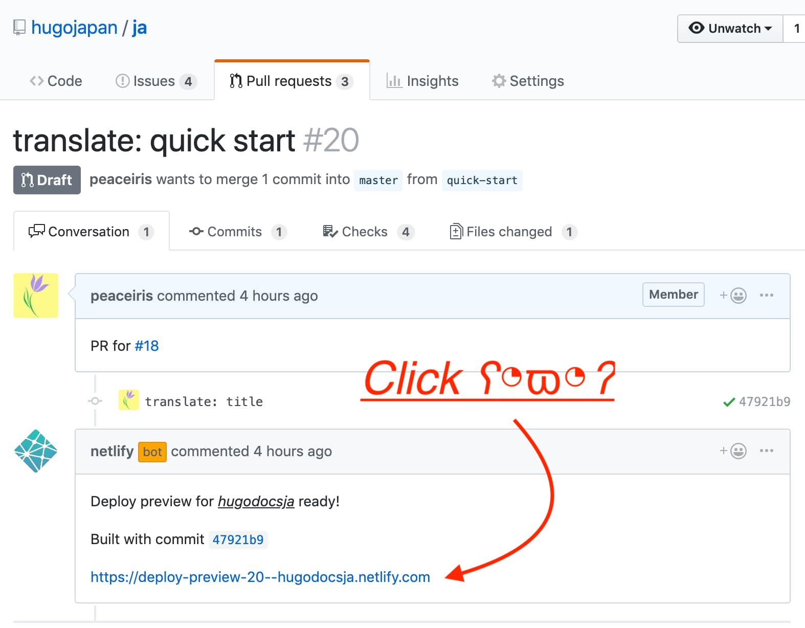

[View on GitHub] | [Main repo] | [Organization]

[](https://circleci.com/gh/hugojapan/ja/tree/master)
[](https://app.netlify.com/sites/hugodocsja/deploys)

<div align="center">

</div>


## Table of Contents

<!-- START doctoc generated TOC please keep comment here to allow auto update -->
<!-- DON'T EDIT THIS SECTION, INSTEAD RE-RUN doctoc TO UPDATE -->


- [About organization](#about-organization)
- [Translation priority](#translation-priority)
- [Notes](#notes)
- [How to contribute](#how-to-contribute)
  - [Issue](#issue)
  - [Process](#process)
  - [Pull request](#pull-request)
  - [Local preview](#local-preview)
  - [textlint](#textlint)
  - [Commit](#commit)
  - [Merge parent branch into child branch](#merge-parent-branch-into-child-branch)
- [Netlify deploy preview](#netlify-deploy-preview)
- [How to contribute after the second](#how-to-contribute-after-the-second)
- [License](#license)

<!-- END doctoc generated TOC please keep comment here to allow auto update -->


## About organization

[Hugo Documentation] の和訳・日本語翻訳プロジェクトです。以下の Issue で提案しました。

- [Translation project for Japanese users · Issue #667 · gohugoio/hugoDocs](https://github.com/gohugoio/hugoDocs/issues/667)

実際に Pull Request を出していただくのは以下の Repository です。

- [hugojapan/ja][Main repo]

以下の Repository はローカルプレビュー用です。

- [hugojapan/hugoDocs][preview repo]


## Translation priority

翻訳の優先順位です。

- ~~Issues で `優先` タグがあるファイルを優先して翻訳してほしいです。~~
- お好きなページの翻訳をお願いします。
- 一部分の翻訳でも構いません。
- 翻訳の訂正なども歓迎します。


## Notes

注意事項です。

翻訳サービスの出力をそのまま利用しないでください。

- ライセンスに引っかかる可能性がある
- まだまだ人間の手直しが必要な品質であることがほとんど
- 参考にする程度で利用してほしい

英文以上の情報を追加しないようにしてください。

- 英文の内容以上の情報を含めるべきと判断した場合は本家に貢献してから
- 良い改善であれば他言語でも共有すべき

翻訳は以下の英語ドキュメントを元に行ってください。

- [Hugo Documentation]


## How to contribute

### Issue

まず [Issue][Issues hugojapan/ja] を見て翻訳の依頼がないかどうか探して、
できそうなものがあればその Issue で「翻訳作業を開始する」というコメントを残してください。

依頼がなければ Issue を作成してどの文書を翻訳するのか宣言してください。
Issue template が用意されているので利用してください。

作業の重複を避けるためにも Issue は良く確認してから参加するなり、新規 Issue を作成するなりしてください。

### Process

- [hugojapan/ja][Main repo] を fork
- [hugojapan/hugoDocs][preview repo] を clone

して、以下のような流れで作業することになるはずです。

```sh
# hugojapan/hugoDocs を clone する。
git clone https://github.com/hugojapan/hugoDocs.git
cd hugoDocs
# preview 用 branch は japanese (デフォルトが japanese になっているはず)

# hugojapan/ja を fork したら hugoDocs の submodule として登録する。
git rm content/ja
git submodule add https://github.com/[your_github_id]/ja.git content/ja
cd content/ja
git remote add upstream https://github.com/hugojapan/ja.git

# node 実行環境が無い方はスキップしても構いません。
npm install

# 作業用 branch を作ってチェックアウトする。
git checkout -b [target]

# add, commit, push を繰り返す。
vim [target].md
git add [target].md
git commit -m "translate: [target]"
git push origin [target]
```

### Pull request

Draft Pull Request を作成する。
必要があれば適宜追加で add, commit, push する。
準備ができたら `Ready for review`

### Local preview

もちろん `hugo server -w` でホットリロードしながらローカルプレビューできます。

- [http://localhost:1313/](http://localhost:1313/)

### textlint

コミットする際に textlint による日本語の校閲が自動で実行されます。
また、個別のファイルに対して `npm run lint [target].md` で校閲ができます。
textlint のルールについて改善案があれば [Issue][Issues hugojapan/ja] を出してください。

node 環境が無い場合でも GitHub の方で CircleCI を使って textlint を実行しているので、
リモートで自動的に校閲されます。

CircleCI により実行している textlint でエラーが発生した時は `Details` をクリックすることで詳細を確認できます。

| GitHub pull request | CircleCI job status |
|---|---|
|  |  |

### Commit

`Squash merge` するので自分で切ったブランチのコミットは適当で構いませんが、
こまめにコミットすると複数人でレビューしやすいかもしれません。

### Merge parent branch into child branch

作業中に master branch で変更があり、それを自分のブランチに取り込みたい場合は
以下のようにして `rebase` は使わずに `merge --no-ff` して親ブランチの変更を取り込んでください。

```sh
git checkout master
git pull upstream master
git checkout [target]
git merge --no-ff master
# commit
git push origin [target]
```


## Netlify deploy preview

- [世界最速のウェブサイト構築フレームワーク - Hugo]

上記リンクは master branch のプレビューです。
Pull request を作成すると Netlify deploy preview のリンクが発行されてプレビューを確認できるようになります。

| Netlify deploy preview | Netlify build status |
|---|---|
|  |  |

なお、これらのプレビューサイトは [robots.txt] を設置して検索エンジンによるインデキシングを拒否しています。
よって、このプレビューサイトが検索結果に表示されてしまう心配はありません。
最終的に日本語ドキュメントも `gohugo.io` のドメインで公開される予定です。

<details>
<summary>Deploy Notes</summary>

```
mkdir .ja && mv * .ja/ && rm -rf hugoDocs && git clone --depth=1 -b japanese https://github.com/hugojapan/hugoDocs.git && cd hugoDocs && mv ../.ja content/ja && hugo --gc --minify --baseURL 'https://hugodocsja.netlify.com/' && echo -e 'User-agent: *\nDisallow: /' > public/robots.txt
```

- Publish directory: `hugoDocs/public`
- Deploy notifications: Enable `Add deploy notifications as pull request comments when deploy succeeds`

</details>


## How to contribute after the second

2回目以降の貢献方法です。

```sh
cd content/ja

# remote master の変更を local master に取り込む。
git checkout master
git pull upstream master

# 作業用 branch を作ってチェックアウトする。
git checkout -b [target]

# add, commit, push を繰り返す。
vim [target].md
git add [target].md
git commit -m "translate: [target]"
git push origin [target]
```

`Draft pull request` を作成して作業を進め、レビューの準備ができたら `Ready for review` してください。


## License

- [gohugoio/hugoDocs LICENSE](https://github.com/gohugoio/hugoDocs/blob/master/LICENSE.md)


<div align="right"><a href="#table-of-contents">Back to TOC ☝️</a></div>


<!-- Internal References -->
[View on GitHub]: https://github.com/hugojapan/hugojapan.github.io

<!-- External References -->
[Main repo]: https://github.com/hugojapan/ja
[preview repo]: https://github.com/hugojapan/hugoDocs
[Organization]: https://github.com/hugojapan
[Hugo Documentation]: https://gohugo.io/documentation/
[Issues hugojapan/ja]: https://github.com/hugojapan/ja/issues
[世界最速のウェブサイト構築フレームワーク - Hugo]: https://hugodocsja.netlify.com/
[robots.txt]: https://hugodocsja.netlify.com/robots.txt
